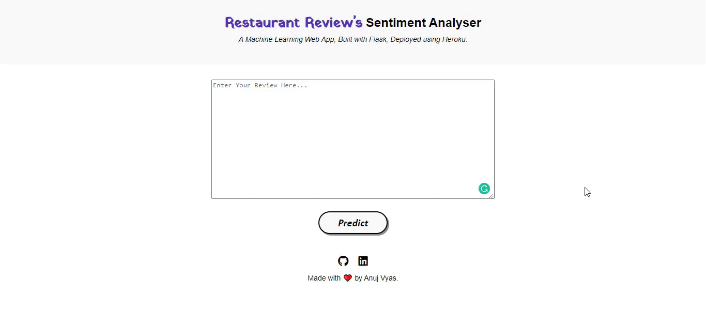
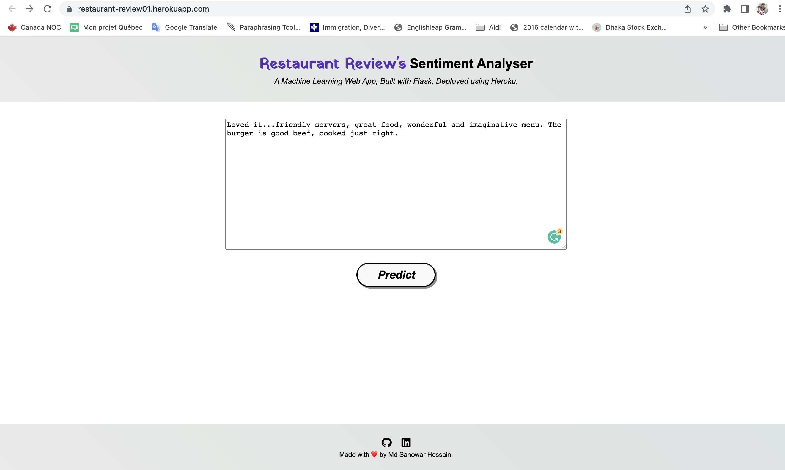

# Sentiment Analysis on Restaurant Review's data
  

[Dataset Link:](https://www.kaggle.com/datasets/d4rklucif3r/restaurant-reviews)

• This repository consists of files required to deploy a ___Machine Learning Model using Web App___ created with ___Flask___ on ___Heroku___ platform.

• Please do ⭐ the repository, if it helped you in anyway.

## Web Application:

## Heroku-web Application:
[Heroku Weblink:](https://restaurant-review01.herokuapp.com/)

